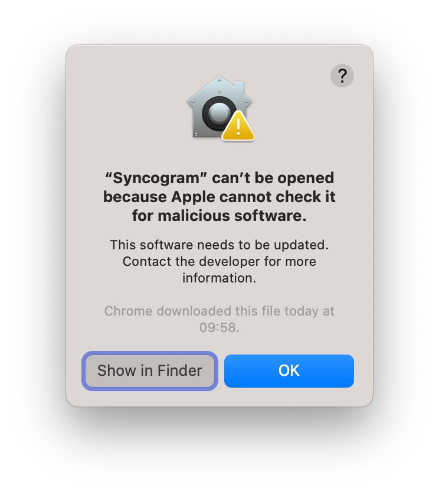
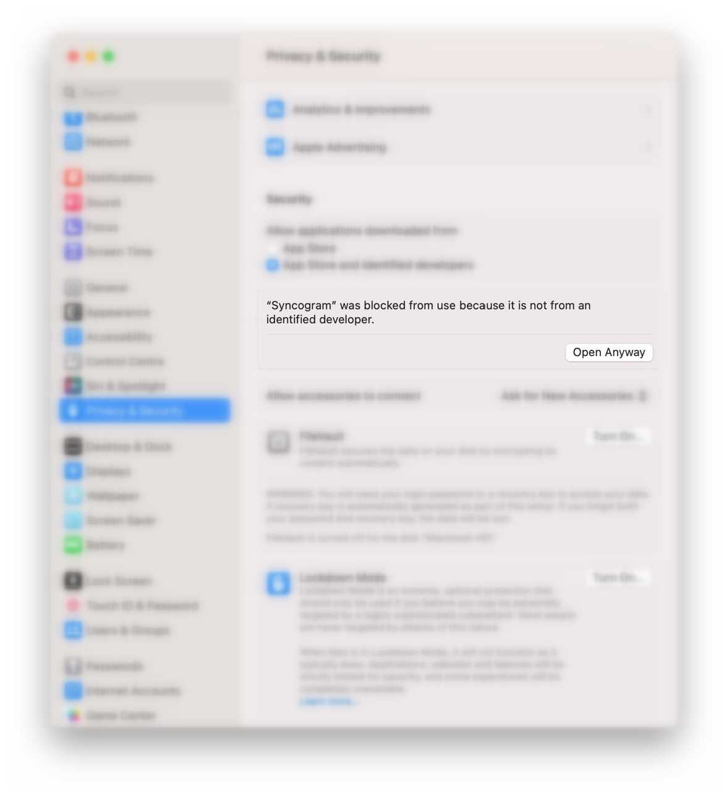

# Syncogram
The application allows you to quickly transfer your channels, saved messages to another telegram account.

> [!IMPORTANT]
> All data associated with the account is stored only on your local computer. We do not transfer or store anything.

  

![Preview of Telegram Desktop][preview_image]

[preview_image]: ./docs/assets/preview.jpg "Preview of Syncogram Application"

# Features
* Syncing first name, last name and biography.
* Syncing personal photos with right sequence.
* Syncing favorite messages with right sequence. _(An inefficient algorithm is used)_
* Backup personals chats with all media and pins. _(soon)_
* Syncing all settings. _(soon)_

# Supports
### Operation Systems
* Windows 10+ x64
* Linux (tested on Ubuntu)
* MacOS 13.04 +

### Pythons
* Windows: Python 3.10+
* Linux: Python 3.9+
* MacOS: Python 3.9+
### Languages
* English
* Russian

# Installation Guide
Fortunately, you can use [binary files](https://github.com/pwd491/syncogram/releases). If you don't want using binaries, you can build or execute your own application.

If you want to build your own application go to [https://my.telegram.org/auth](https://my.telegram.org/auth) and get **API** data.  
> [!WARNING]
> Be careful and do not transfer this data to strangers, telegram does not allow you to reset this data.

# Build Windows | Linux | MacOS
_It is strongly recommended to use [Python version 3.12](https://www.python.org/downloads/release/python-3123/) and the [Poetry](https://python-poetry.org/docs/#installation) package manager._  
_If you don't want to use Poetry, use the pip file **requirements.txt** to install dependencies._
1. `git clone https://github.com/pwd491/Syncogram.git && cd Syncogram` 
2. `poetry env use python3.12 || poetry env use python3 || poetry env use python`
3. `poetry shell && poetry install`
4. _Do next steps:_ 
- Create **environments.py** file into **Syncogram/sourcefiles/telegram**
- Paste your **API** data like: API_ID=*** API_HASH=***
5. `source ./scripts/build.sh || .\scripts\build.bat`
6. Open craft folder and enjoy.

# Execute source code
1. Repeat the previous steps 1, 2, 3, 4.
7. `flet run ./Syncogram/application.py || flet run Syncogram\application.py`

# MacOS trouble
If you're execute binary files on your mac machine, you can have this problem.

To fix it go to **Settings** → **Privacy & Security** and submit **Open Anyway** like on picture.

# Contacts
> [Telegram](https://t.me/sergeydegtyar) — [Email](mailto:sergeydegtyar@internet.ru) — [Issues](https://github.com/pwd491/syncogram/issues) — [Pull Requests](https://github.com/pwd491/Syncogram/pulls) — [Project Channel](https://t.me/syncogram) — [ToDo List](TODO.md)